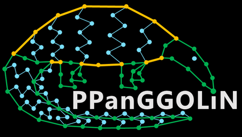

# PPanGGOLiN: Depicting microbial species diversity via a Partitioned PanGenome Graph Of Linked Neighbors

[](https://github.com/labgem/ppanggolin/actions)
[](http://www.cecill.info/licences.fr.html)
[](https://anaconda.org/bioconda/ppanggolin)
[](https://github.com/labgem/ppanggolin/)
[](https://github.com/labgem/ppanggolin/issues)
[](https://ppanggolin.readthedocs.io)
[](https://bioconda.github.io/recipes/ppanggolin/README.html#download-stats)

**PPanGGOLiN**
([Gautreau et al. 2020](https://doi.org/10.1371/journal.pcbi.1007732)) is a software suite used to create and manipulate prokaryotic pangenomes from a set of either genomic DNA sequences or provided genome annotations.
It is designed to scale up to tens of thousands of genomes.
It has the specificity to partition the pangenome using a statistical approach rather than using fixed thresholds which gives it the ability to work with low-quality data such as *Metagenomic Assembled Genomes (MAGs)* or *Single-cell Amplified Genomes (SAGs)* thus taking advantage of large scale environmental studies and letting users study the pangenome of uncultivable species.

**PPanGGOLiN** builds pangenomes through a graphical model and a statistical method to partition gene families in persistent, shell and cloud genomes.
It integrates both information on the presence/absence of protein-coding genes and their genomic neighborhood to build a graph of gene families where each node is a gene family, and each edge is a relation of genetic contiguity.
The partitioning method promotes that two gene families that are consistent neighbors in the graph are more likely to belong to the same partition.
It results in a Partitioned Pangenome Graph (PPG) made of persistent, shell and cloud nodes drawing genomes on rails like a subway map to help biologists navigate the great diversity of microbial life.


Moreover, the panRGP method ([Bazin et al. 2020](https://doi.org/10.1093/bioinformatics/btaa792)) included in **PPanGGOLiN** predicts, for each genome, Regions of Genome Plasticity (RGPs) that are clusters of genes made of shell and cloud genomes in the pangenome graph.
Most of them arise from Horizontal gene transfer (HGT) and correspond to Genomic Islands (GIs). 
RGPs from different genomes are next grouped in spots of insertion based on their conserved flanking persistent genes.


Those RGPs can be further divided in conserved modules by panModule ([Bazin et al. 2021](https://doi.org/10.1101/2021.12.06.471380)). Those conserved modules correspond to groups of cooccurring and colocalized genes that are gained or lost together in the variable regions of the pangenome.

A complete documentation is available [here](https://ppanggolin.readthedocs.io).

<!--  -->

<!-- center the image with html syntax -->
<p align="center">
  
</p>

# Installation

**PPanGGOLiN** can be is easily installed via conda, accessible through the bioconda channel.

To ensure a smoother installation and avoid conflicting dependencies, it's highly recommended to create a dedicated environment for PPanGGOLiN:

```bash
# Install PPanGGOLiN into a new conda environment
conda create -n ppanggolin -c defaults -c conda-forge -c bioconda ppanggolin

# Check PPanGGOLiN install
conda activate ppanggolin
ppanggolin --version
```

# Quick usage

## Run a complete pangenome analysis

A complete pangenomic analysis with PPanGGOLiN can be performed using the [`all`](https://ppanggolin.readthedocs.io/en/latest/user/QuickUsage/quickAnalyses.html#ppanggolin-complete-workflow-analyses) subcommand. This workflow runs a series of PPanGGOLiN commands to generate a **partitioned pangenome graph** with predicted **RGPs** (Regions of Genomic Plasticity), **spots** of insertion and **modules**.


Execute the following command to run the `all` workflow:

```bash
ppanggolin all --fasta GENOMES_FASTA_LIST
```

By default, it uses parameters that we have found to be generally the best for working with species pangenomes. For further customization, you can adjust some parameters directly on the command line. Alternatively, you can use a configuration file to fine-tune the parameters of each subcommand used by the workflow (see [here](https://ppanggolin.readthedocs.io/en/latest/user/practicalInformation.html#configuration-file) for more details).

### Input files

The file `GENOMES_FASTA_LIST` is a tsv-separated file with the following organization :

1. The first column contains a unique genome name **(without space)**
2. The second column contains the path to the associated FASTA file
3. Circular contig identifiers are indicated in the following columns
4. Each line represents a genome

An [example](testingDataset/genomes.fasta.list) with 50 *Chlamydia trachomatis* genomes can be found in the [testingDataset/](testingDataset/) directory.


You can also give **PPanGGOLiN** your own annotations using *.gff* or *.gbff/.gbk* files instead of *.fasta* files,
such as the ones provided by [Bakta](https://github.com/oschwengers/bakta) with the following command :

```bash
ppanggolin all --anno GENOMES_ANNOTATION_LIST
```

Another [example](testingDataset/genomes.gbff.list) of such a file can be found in the [testingDataset/](testingDataset/) directory.


A minimum of 5 genomes is generally required to perform a pangenomic analysis using the traditional *core genome*/*accessory genome* paradigm.
It is recommended to use at least 15 genomes with genomic variation (and not only SNPs) to obtain robust results with the **PPanGGOLiN** statistical approach.

### Results files

Upon executing the `all` command, multiple output files and graphics are generated  (more information [here](https://ppanggolin.readthedocs.io/en/latest/user/QuickUsage/quickAnalyses.html#usual-pangenome-outputs)). Most notably, it writes an HDF-5 file (`pangenome.h5`).
This file can be used as input to any of the subcommands to rerun parts of the analysis with different parameters,
write and draw different representations of the pangenome, or perform additional analyses with **PPanGGOLiN**.


## Other Workflow Commands

PPanGGOLiN offers additional workflow commands that perform more specialized functions:

- [**`workflow`**](https://ppanggolin.readthedocs.io/en/latest/user/PangenomeAnalyses/pangenomeAnalyses.html#workflow): Generates a partitioned pangenome graph.
- [**`panrgp`**](https://ppanggolin.readthedocs.io/en/latest/user/RGP/rgpAnalyses.html#panrgp): Combine the `workflow` command and the prediction of RGPs (Regions of Genomic Plasticity) and insertion spots on top of the partitioned pangenome graph.
- [**`panmodule`**](https://ppanggolin.readthedocs.io/en/latest/user/Modules/moduleAnalyses.html#the-panmodule-workflow): Combine the `workflow` command and the prediction of Modules on top of the partitioned pangenome graph.

These commands utilize the same type of file input as the `all` command.


# Issues, Questions, Remarks
If you have any questions or issues with installing,
using or understanding **PPanGGOLiN**, please do not hesitate to post an issue!
We cannot correct bugs if we do not know about them, and will try to help you the best we can.

# Citation
If you use this tool for your research, please cite:

Gautreau G et al. (2020) **PPanGGOLiN**: Depicting microbial diversity via a partitioned pangenome graph.
PLOS Computational Biology 16(3): e1007732. <https://doi.org/10.1371/journal.pcbi.1007732>

If you use this tool to study genomic islands, please cite:

Bazin et al., panRGP: a pangenome-based method to predict genomic islands and explore their diversity, Bioinformatics, Volume 36, Issue Supplement_2, December 2020, Pages i651–i658, <https://doi.org/10.1093/bioinformatics/btaa792>

If you use this tool to study modules, please cite:

Bazin et al., panModule: detecting conserved modules in the variable regions of a pangenome graph. biorxiv. <https://doi.org/10.1101/2021.12.06.471380>
