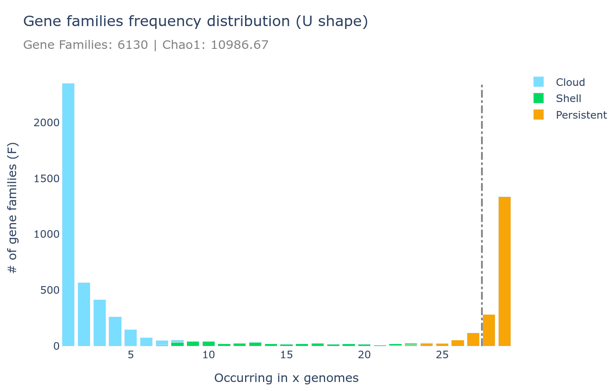
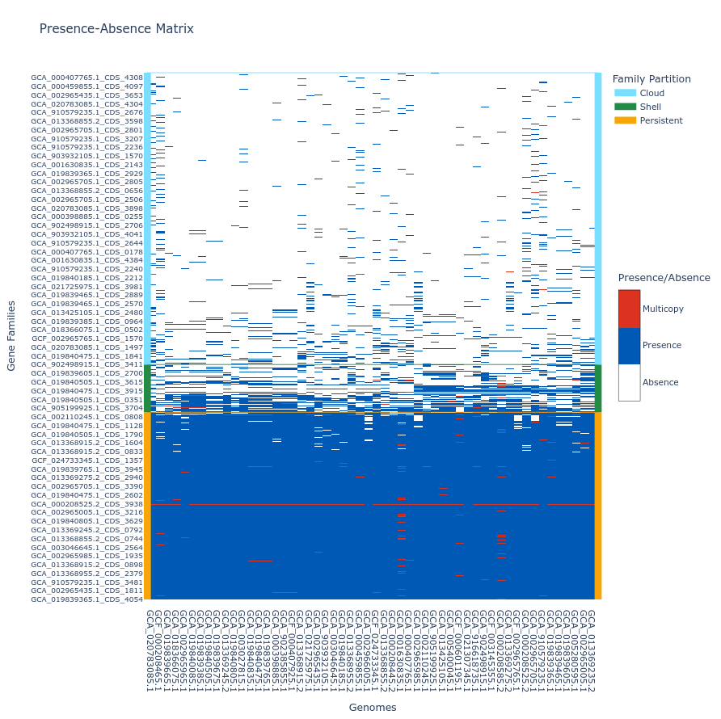
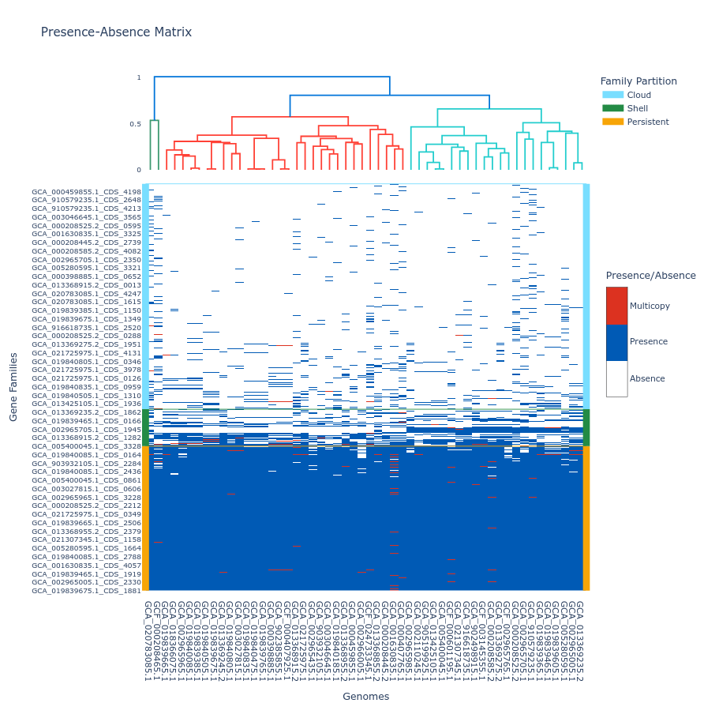
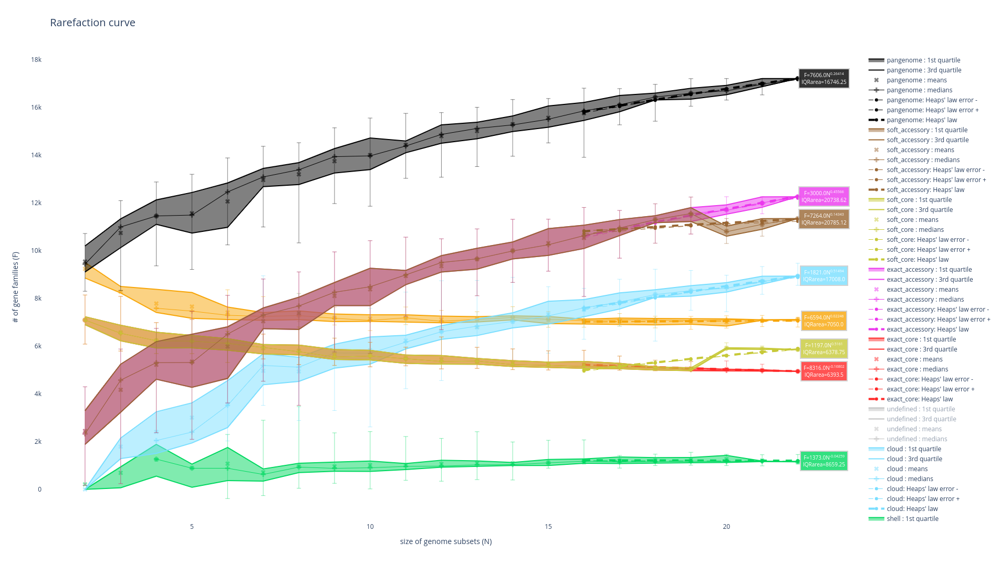

### Pangenome figures output

#### U-shape plot
A U-shaped plot is a figure showing the number of families (y-axis) per number of genomes (x-axis). The grey dashed vertical line represents the threshold used to define the soft_core.
It is a .html file that can be opened with any browser and with which you can interact, zoom, move around, mouseover to see numbers in more detail, and you can save what you see as a .png image file.

It can be generated using the `draw` subcommand as such : 

```bash
ppanggolin draw -p pangenome.h5 --ucurve
```





#### Tile plot

A tile plot is similar to a heatmap representing the gene families (y-axis) in the genomes (x-axis) making up your pangenome. The tiles on the graph will be colored if the gene family is present in a genome (either in blue or red if the gene family has multiple gene copies) and uncolored if absent. The gene families are ordered by partition and then by their number of presences, and the genomes are ordered by a hierarchical clustering based on their shared gene families via a Jaccard distance (basically two genomes that are close together in terms of gene family composition will be close together on the figure).

This plot is quite helpful to observe potential structures in your pangenome, and can help you identify eventual outliers. You can interact with it, and mousing over a tile in the plot will indicate the gene identifier(s), the gene family and the genome corresponding to the tile. As detailed below, additional metadata can also be added.

If you build your pangenome using a workflow subcommands (`all`, `workflow`, `panrgp`, `panmodule`) and you have more than 32 767 gene families, only the 'shell' and the 'persistent' partitions will be drawn, leaving out the 'cloud' as the figure tends to be too heavy for a browser to open it otherwise. Beyond the workflow subcommand, you can generate the plot with any number of gene families or genomes. However, no browser currently supports visualizing a tile plot containing more than 65,535 gene families or more than 65,535 genomes (for more information, refer to [this Stack Overflow discussion](https://stackoverflow.com/questions/78431835/plotly-heatmap-has-limit-on-data-size)
 ).

To generate a tile plot, use the 'draw' subcommand as follows:

```bash
ppanggolin draw -p pangenome.h5 --tile_plot
```



If you prefer not to include 'cloud' gene families, which can make the plot difficult to render in a browser, you can use the `--nocloud` option:

```bash
ppanggolin draw -p pangenome.h5 --tile_plot --nocloud
```

To include a dendrogram on top of the tile plot, use the `--add_dendrogram` option:

```bash
ppanggolin draw -p pangenome.h5 --tile_plot --add_dendrogram
```



If you have added metadata to the gene elements of your pangenome (see [metadata documentation](../metadata.md) for details), you can display this metadata in the hover text by using the `--add_metadata` argument.


#### Rarefaction curve
This figure is not drawn by default in the 'workflow' subcommand as it requires a lot of computations. It represents the evolution of the number of gene families for each partition as you add more genomes to the pangenome. It has been used a lot in the literature as an indicator of the diversity that you are missing with your dataset on your taxonomic group (Tettelin et al., 2005). The idea is that if at some point when you keep adding genomes to your pangenome you do not add any more gene families, you might have access to your entire taxonomic group's diversity. On the contrary, if you are still adding a lot of genes you may be still missing a lot of gene families. 

There are 8 partitions represented. For each of the partitions, there are multiple representations of the observed data. You can find the observed means, medians, 1st and 3rd quartiles of the number of gene families per number of genome used. You can also find the best fitting of the data by the Heaps' law, which is usually used to represent this evolution of the diversity in terms of gene families in each of the partitions.

It can be generated using the 'rarefaction' subcommand, which is dedicated to drawing this graph, as such : 

```bash
ppanggolin rarefaction -p pangenome.h5
```




A lot of options can be used with this subcommand to tune your rarefaction curves, most of them are the same as with the `partition` workflow.
The following 3 are related to the rarefaction alone:

- `--depth` defines the number of sampling for each number of genomes (default 30)
- `--min` defines the minimal number of genomes in a sample (default 1)
- `--max` defines the maximal number of genomes in a sample (default 100)

So for example the following command:

```bash
ppanggolin rarefaction -p pangenome.h5 --min 5 --max 50 --depth 30
```

Will draw a rarefaction curve with sample sizes between 5 and 50 (between 5 and 50 genomes will be used), and with 30 samples at each point (so 30 samples of 5 genomes, 30 samples or 6 genomes ... up to 50 genomes).
