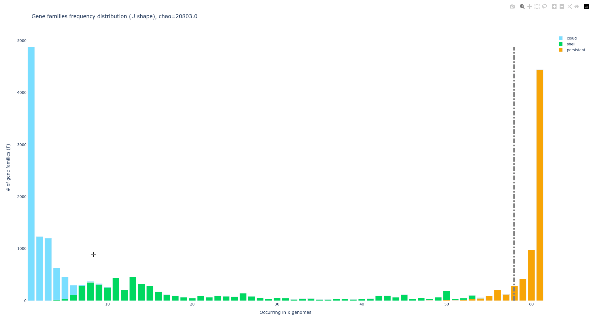

## Classic pangenome outputs

The workflow subcommand generate automatically some files and figures. 
Here, we are going to describe some of them that are useful and classic in pangenomic analyses, 
as they describe the pangenome of your taxonomic group of interest in different ways.

### Statistics and metrics on the pangenome
#### Organisms statitics

[//]: # (TODO change this subsection after merge of split_write)

PPanGGOLiN can generate a tab-separated file describing the content of each of the genome used for building the pangenome.
It might be useful when working with fragmented data such as *MAGs* or if you suspect some of your genomes to be chimeric,
or to not belong to your taxonomic group (as those genomes will be outliers regarding to the numbers in this file).
The first lines starting with a '#' are indicators of parameters used when generating the numbers describing each organisms, and should not be read if loading this into a spreadsheet. They will be skipped automatically if you load this file with R.

This file is made of 15 columns described in the documentation here.

It can be generated using the 'write' subcommand as such : 

`ppanggolin write -p pangenome.h5 --stats -o path/to/your/results/directory/`

```{note}
This command will also generate the 'mean_persistent_duplication.tsv' file.
```

#### Gene presence absence

This file is basically a presence absence matrix. 
The columns are the genomes used to build the pangenome, the lines are the gene families. 
The identifier of the gene family is the gene identifier chosen as a representative. 
There is a 1 if the gene family is present in a genome, and 0 otherwise.
It follows the exact same format than the 'gene_presence_absence.Rtab' file that you get from the pangenome analysis software [roary](https://sanger-pathogens.github.io/Roary/)

More information about this file can be found [here](../PangenomeAnalyses/pangenomeStat.md#gene-presenceabsence)

#### mean persistent duplication
This file is a .tsv file, with a single parameter written as a comment at the beginning of the file, 
which indicates the proportion of genomes in which a gene family must be present more than once to be considered 'duplicated' (and not single copy marker). 
This file lists the gene families, their duplication ratio, their mean presence in the pangenome and whether it is considered a 'single copy marker' or not, 
which is particularly useful when calculating the completeness recorded in the [organisms statistics file](#organisms-statitics) described previously.

### Figures
#### U-shaped plot:  gene families frequency distribution in pangenome

A U-shaped plot is a figure presenting the number of families (y-axis) per number of organisms (x-axis). 
It is a _.html_ file that can be opened with any browser and with which you can interact, zoom, move around, 
mouseover to see numbers in more detail, and you can save what you are seeing as a .png image file.



A dotted grey bar on the graph representing the **soft core threshold** which is the lower limit for which families are present in the majority of genomes. By default this value is 95% (so families are in more than 95 genomes).
Look at [here](../PangenomeAnalyses/pangenomeFigures.md#u-shape-plot) to change the default parameters.


#### Tile plot: detect pangenome structure and outlier
A tile plot is a heatmap representing the gene families (y axis) in the organisms (x axis) making up your pangenome. 
The tiles on the graph will be colored if the gene family is present in an organism and uncolored if absent. 
The gene families are ordered by partition, and the genomes are ordered by a hierarchical clustering based on their shared gene families (basically two genomes that are close together in terms of gene family composition will be close together on the figure).

This plot is quite helpful to observe potential structures in your pangenome, and can also help you to identify eventual outliers.
You can interact with it, and mousing over a tile in the plot will indicate to you which is the gene identifier(s),
the gene family and the organism that corresponds to the tile.


[//]: # (TODO Explain the bar on the right side)

With the 'workflow' subcommand, if you have more than 500 organisms, only the 'shell' and the 'persistent' partitions will be drawn, leaving out the 'cloud' as the figure tends to be too heavy for a browser to open it otherwise. Look at [here](../PangenomeAnalyses/pangenomeFigures.md#tile-plot) to add the cloud if you need.

```{note}
If you want the 'cloud' gene families even if a lot of data can be hard to open with a browser sometimes,
you can generate the tile plot as explain [here](../PangenomeAnalyses/pangenomeFigures.md#tile-plot)
```

#### Rarefaction curve: indicator of the taxonomic group diversity

```{note}
The rarefaction curve is not drawn by default in the 'workflow' subcommand as it requires a lot of computations. 
To compute it add the option `--rarefaction` to the subcommand or look at [here](../PangenomeAnalyses/pangenomeFigures.md#rarefaction-curve) for more information. 
```
The rarefaction curve represents the evolution of the number of gene families for each partition as you add more genomes to the pangenome.
It has been used a lot in the literature as an indicator of the diversity that you are missing with your dataset on your taxonomic group.
The idea is that if at some point when you keep adding genomes to your pangenome you do not add any more gene families,
you might have access to your entire taxonomic group's diversity.
On the contrary if you are still adding a lot of genes you may be still missing a lot of gene families.

There are 8 partitions represented. For each of the partitions there are multiple representations of the observed data.
You can find the observed: *means*, *medians*, *1st* and *3rd quartiles* of the number of gene families per number of genome used. 
And you can find the *fitting* of the data by the **Heaps' law**, which is usually used to represent this evolution of the diversity in terms of gene families in each of the partitions.

### pangenomeGraph files
The pangenome's graph can be given through multiple data formats, in order to manipulate it with other softwares.
All the formats provided by PPanGGOLiN are describe [here](../PangenomeAnalyses/pangenomeGraph.md#pangenome-graph-output)


The Graph can be given through the _light.gexf files that contain the gene families as nodes and the edges between gene families describing their relationship. He is not exhaustive, but he is easier to manipulate and for most of the users, the information in it is enough.

```{note}
They can be manipulated and visualised through a software called [Gephi](https://gephi.org/). 
Find more information on how to use Gephi [here](../PangenomeAnalyses/pangenomeGraph.md#gephi)
```

